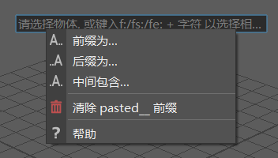

# 界面

## 下载地址

[oneLiner.zip](https://anonfiles.com/r1eaf2icy5/oneLiner_zip)

## 运行环境

windows
python3.x PySide2
maya2022 pymel-1.2.0

## 待优化

- [ ] 预览的列表框不能完美显示出选中的对象
- [ ] 添加对maya重名对象的预览支持
- [ ] 右击查看帮助改右边按钮/悬停，点击查看gif教程
- [ ] 安装时弹出窗口设置快捷键

## 使用教程

### 安装

- 打开文件目录，注意路径不要有特殊字母和中文
- 将install.mel文件拖拽进maya视图窗口
- 工具将自动添加到当前工具架上

**tips：推荐使用自定义快捷键，将工具架里的代码复制进热键编辑器里，指定一个快捷键**

### 具体操作

#### 基础操作

- 选中的对象执行脚本，选中对象的名称会预览在输入框下方，并实时更新

##### > 查找和替换

- 旧名字>新名字

##### ! # @ 符号的使用 

- **!** 表示对象的旧名称，输入时键入 **! **操作用来代替旧名称

- **#** 表示数字，根据选择对象的顺序排序

- **@** 表示字母，根据选择对象的顺序排序

##### /s /h 应用于选定/层级

- **/s** 模式默认，无需特殊标注
- **/h** 作用与所选对象及其层级，在末尾键入**/h**

##### + - -- 删除字符

- **+数字** 组合使用，从名字开端删除字符，**+**表示从前往后，**数字**表示删除几个字符
- **-数字** 组合使用，从名字结尾删除字符，**-**表示从后往前，**数字**表示删除几个字符
- **--数字** 组合使用，从结尾删除字符，**数字**表示删到只剩几个字符

##### f: fs: fe: 附加功能

- **f: xxx** 选中所有含有**xxx**字符的对象，**xxx**为空则选择所有，回车后选中名字里含有**xxx**的对象
- **fs: xxx** 选中开头含有**xxx**字符的对象，**xxx**为空则选择所有，回车后选中开头含有**xxx**对象
- **fe: xxx** 选中结尾含有**xxx**字符的对象，**xxx**为空则选择所有，回车后选中结尾含有**xxx**对象

##### 右击查看帮助

## 鸣谢

- oneLiner原作者：

    Fauzan Syabana
    zansyabana@gmail.com
    重命名功能代码沿用自原作者

- oneLiner原文链接：

    [https://www.highend3d.com/maya/script/oneliner-simple-renamer-tool-for-maya](<https://www.highend3d.com/maya/scriponeliner-simple-renamer-tool-for-maya>)

