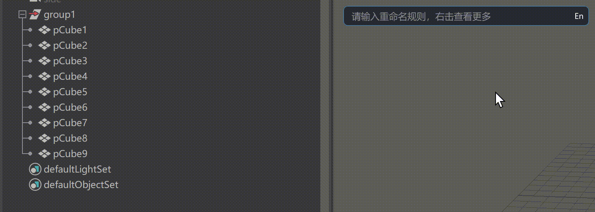
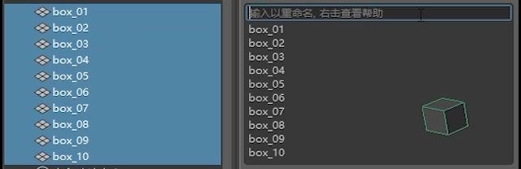
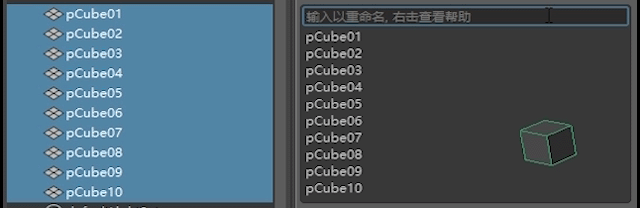
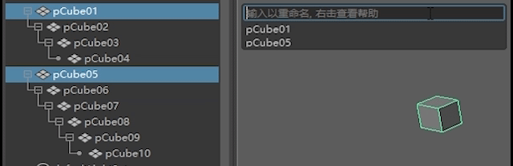
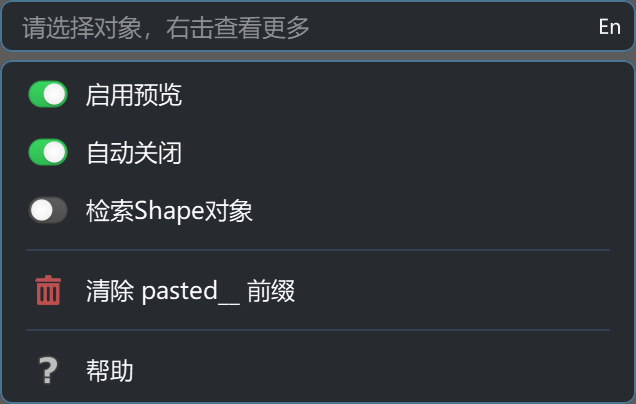
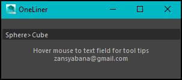

# OneLiner

面向 Maya 的极简重命名插件。界面只有一行输入框，但内置了实时树预览、批量替换、通配符选择、层级与类型过滤，以及常用辅助菜单。

## 已经集成进[OneMaya]([https://github.com/ai12989757/oneLiner.git](https://github.com/ai12989757/OneMaya.git)，oneLiner库不再独立更新，新链接[OneLiner](https://github.com/ai12989757/OneMaya/tree/main/Plugin/Common/OneLiner)

## [English](README.md) | 简体中文

## 界面


## 运行环境

- Windows
- Maya 2017+

## 当前特性

- 单行输入，回车立即执行重命名
- 实时预览当前规则结果，层级模式下以树结构显示
- 支持重名对象预览与层级路径排序
- 支持旧名复用、数字编号、字母编号
- 支持删除字符、局部替换、批量顺序替换
- 支持通配符快速选择对象
- 支持 `-h`、`-s`、`-type` 规则过滤
- 右键菜单可切换预览、自动关闭、通配符是否包含 shape，并提供帮助与清理 `pasted__` 前缀
- 支持输入法全角符号兼容，常用规则符号不会因中英文输入法切换而失效

## 安装

### 直接安装

1. 确保仓库路径尽量只包含英文、数字和常规路径字符。
2. 如果仓库里还没有编译好的插件，先运行仓库根目录下的 `build.bat`。
3. 把 `install.mel` 拖进 Maya 视口执行。
4. 安装脚本会加载当前 Maya 版本对应的 `bin/<版本>/oneLiner.mll`，并自动注册图标路径。


### 源码构建

在仓库根目录执行：

```bat
build.bat
```

编译完成后插件输出到 `bin/<MayaVersion>/oneLiner.mll`。

## oneLiner 命令（Maya）

插件也可以通过 Maya 命令行方式调用。示例：

- 打开 UI：

```mel
oneLiner -showWindow;
```

- 获取规则预览（不执行重命名）：

```mel
oneLiner -rule "ctrl_##/3" -preview;
```

- 从脚本直接执行重命名：

```mel
oneLiner -rule "L_>R_" -execute;
```

可用标志：

- `-showWindow / -sw` — 打开插件 UI
- `-rule / -r <text>` — 传入规则字符串
- `-preview / -p` — 返回预览列表（不执行重命名）
- `-execute / -e` — 直接执行重命名
- `-mode / -m <s|h|a>` — 强制作用域（`s`=selected, `h`=hierarchy, `a`=all）
- `-clearPasted / -cp` — 清理 `pasted__` 前缀
- `-help / -h` — 输出命令帮助文本（包含中/英两种说明）

## 使用说明

### 基础流程

1. 在 Maya 中选中对象。
2. 打开 oneLiner。
3. 在输入框中输入规则。
4. 下方预览会实时刷新。
5. 按回车执行。



### 规则速查

#### `!` `#` `@`

- **`!`**：复用对象旧名称，例如 `side_!`（把旧名的一部分复用到新名）。
- **`#`**：数字编号。使用多个 `#` 控制补零位数：`ctrl_##` → `01, 02, ...`。
  - 使用 `/N` 指定起始编号：`ctrl_##/3` → `03, 04, ...`。`\`也支持，例如 `ctrl_##\3`。
- **`@`**：字母编号，支持两种模式：
  - **单个 `@`（可扩展、进位）：** `@` 会生成 `A, B, ..., Z, AA, AB, ...`（溢出时向左进位）。
  - **多个 `@`（固定宽度）：** `@@` / `@@@` 保留精确字母位数。例如 `@@` 会生成 `AA, AB, ..., AZ, BA, ...`。
  - 可通过在标记后使用 `/` 提供起始模板与大小写控制：`@@/Aa` 表示从 `Aa` 开始，模板中大写字母表示该位为大写，小写字母表示该位为小写；若省略，固定宽度缺省从 `A...A` 开始。`\` 同样支持，例如 `@@\Aa`。

注意：

- 常见输入法产生的全角符号（如 `！ ？ ＃ ＠ ＊`）会自动规范为半角符号，保证规则在中/英输入模式下行为一致。
- 如果起始模板不合法，规则引擎会退化为把标记当作普通文本处理，以避免在预览中产生不期望的前缀。





#### 查找替换

- `old>new`：单组局部替换
- `Mesh A>Joint B`：按顺序替换多组文本
- `Mesh,A>Joint,B`：同样支持英文逗号分隔
- `Mesh，A>Joint，B`：同样支持中文逗号分隔

示例：

- `L_>R_`
- `Mesh A>Joint B`
- `Ctrl,FK>Drv,IK`


#### 删除字符

- `+数字`：从开头删除指定字符数
- `-数字`：从结尾删除指定字符数
- `--数字`：只保留前 N 个字符

示例：

- `+3`
- `-2`
- `--6`


#### 层级与类型过滤

- `-h`：把当前选中对象及其所有子级加入候选
- `-h -s`：层级模式下同时包含 shape
- `-type joint blendShape`：按 Maya 节点类型过滤

说明：

- 默认只处理当前选择
- 如果 `-type` 在当前候选中找不到对象，会退化为全局类型检索



#### 通配符选择

- 直接输入 `*` 或 `?` 会走 Maya 原生通配符匹配
- 回车后不是重命名，而是直接更新选择集
- 右键菜单里的“检索Shape对象”只影响通配符结果

示例：

- `ctrl_*`
- `L_arm_??`

#### 预览与输入历史

- 预览区会实时展示当前候选和重命名结果
- 层级模式下预览为树结构，并显示节点图标
- 双击预览项可把该项原始文本写回输入框
- 方向键上/下可浏览当前 Maya 会话内的输入历史

## 右键菜单

输入框右键可打开工具菜单，当前包含：

- 启用预览
- 自动关闭
- 检索Shape对象
- 清除 `pasted__` 前缀
- 帮助



## 项目结构

- `script/`：Maya 插件与 UI 主要逻辑
- `OneQtC++/`：当前项目使用的 OneQt 组件与测试
- `images/`：README 与帮助面板使用的图片、gif、图标
- `install.mel`：Maya 安装入口
- `build.bat`：仓库根目录构建脚本

## 鸣谢

- 原作者：Fauzan Syabana
- 邮箱：zansyabana@gmail.com
- 原始项目页面：<https://www.highend3d.com/maya/script/oneliner-simple-renamer-tool-for-maya>

重命名核心思路沿用自原作者，本项目在此基础上补充了 Maya 插件化、现代化 UI、树形预览和更多规则支持。



## 许可证

[MIT](LICENSE)
